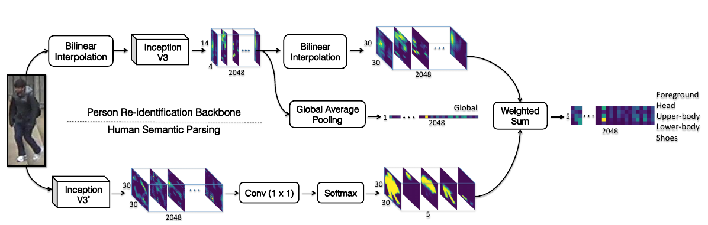

# Human Semantic Parsing for Person Re-identification

### 引言

混乱的背景、光照、视角等因素制约了提取鲁棒性特征的能力，为了改进性能，通常提取人的各部分特征，即用局部(part-level)特征来改进全局(image-level)表示。但其在低分辨率情况下效果会比较差，局部一点的错误可能会传递，从而影响到全局。所以一些研究会倾向于从图像块、水平条提取特征(例如PCB)，它们与人的各部分有少许的联系。

本文用人体语义解析的方法来帮助特征提取，补充特征表示。

### 创新点

1. 使用简单有效的训练方法能够显著超过SOA(state-off-the art)(作者使用多个数据集进行训练，迭代次数也很多，虽然是超过了SOA的水平，但标准不一样，也不能直接比较mAP和rank1吧？)。

2. 提出了SPReID，用人体语义解析来提取局部视觉线索。

3. 提升了reid性能，达到了SOA。

### 主要思想

如上图所示，整个网络分为两部分，一部分是reid，用于提取特征；另一部分是human parsing的过程，用于解析人体各部分。然后把两部分进行加权求和计算，得到人体各部分的特征，用于最后的特征匹配。

### 个人理解

1. 论文的思想非常值得借鉴，使用人体语义分割模型可以清楚的分离出各部件，可以避免掉一些遮挡、缺失带来的特征提取不准确的情况。

2. 虽然文中一再强调超过了SOA，但是是使用大数据集来训练的，和SOA在数据上不一致，直接比较可能有些不妥。

3. SPReID模型是把reid和human parsing分开训练的，可以考虑把两部分合并，做成e2e模型，直接输出人体各部分特征。文中说用较浅的Inception-V3就有不错的性能了，如果改为e2e的话，模型的选择上可能还需要做一些实验。
