# Person-ReID

### 1. 调研目前re-id网络识别错误的原因，思考如何解决pose和occlusion的问题

1. 遮挡：  
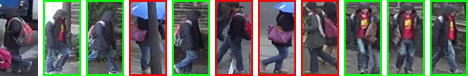  
  
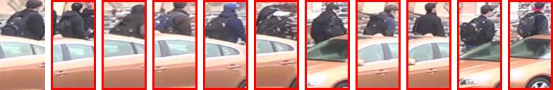  
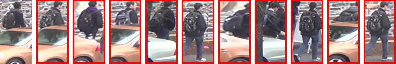  
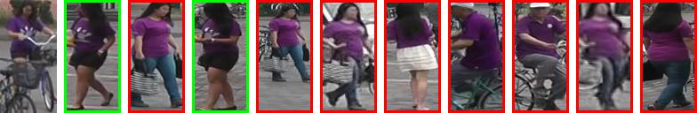  
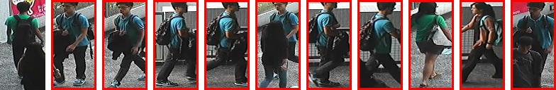  

2. 多目标(效果比较差)：  
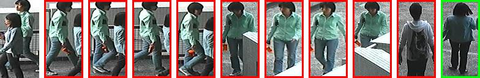  
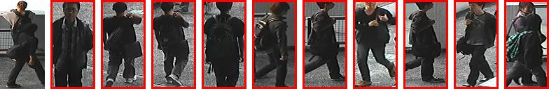  
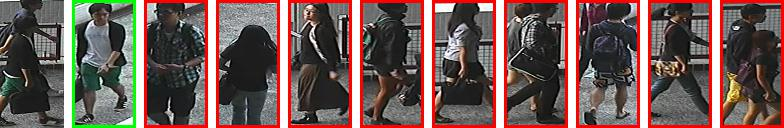  
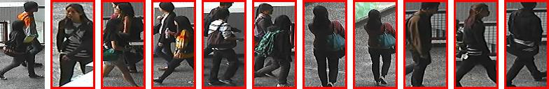  
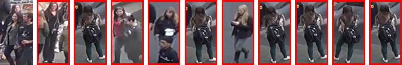

3. 低分辨率(有影响，但不是非常严重)：  
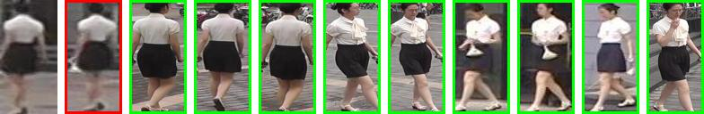  
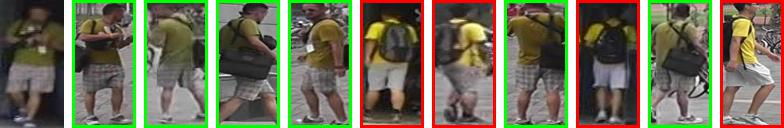  
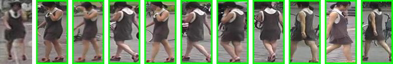  
  

4. 弱光线(黑衣服影响更大)：  
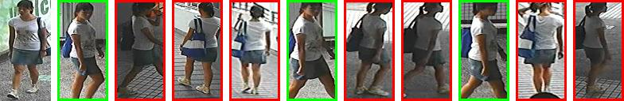  
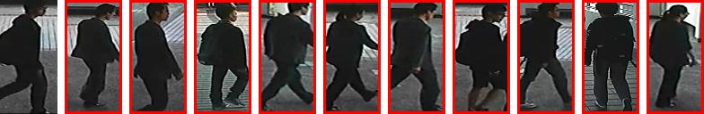  
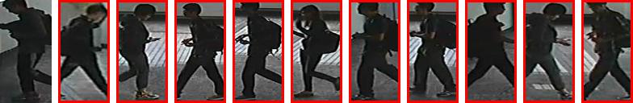  
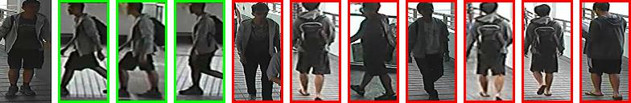

### 2. 看re-id跟make, human parsing相结合的论文

- [CVPR2018: Human Semantic Parsing for Person Re-identification](https://github.com/wyg1997/PersonReID-paper/blob/master/documents/CVPR2018/Kalayeh_Human_Semantic_Parsing_CVPR_2018.pdf)  
>[解读](https://github.com/wyg1997/PersonReID-paper/blob/master/reading/CVPR2018/Kalayeh_Human_Semantic_Parsing_CVPR2018.md)

- CVPR2018: MaskReID: A Mask Based Deep Ranking Neural Network for Person Re-identification

- CVPR2018: Mask-guided Contrastive Attention Model for Person Re-Identification

### 3. 总结目前human parsing最好的模型

- CVPR2017: Look into Person: Self-supervised Structure-sensitive Learning and A New Benchmark for Human Parsing

- ICCV2015: Human Parsing with Contextualized Convolutional Neural Network

### 4. spatial attention的相关工作
