# Person-ReID

### 1. 调研目前re-id网络识别错误的原因，思考如何解决pose和occlusion的问题

1. 遮挡：  
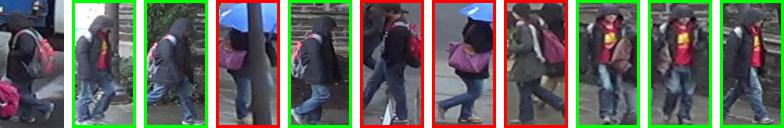  
  
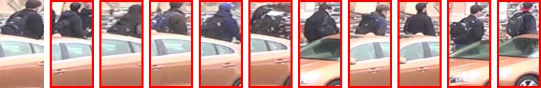  
  
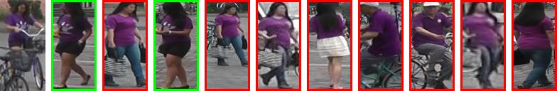  
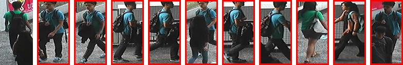  

2. 多目标(效果比较差)：  
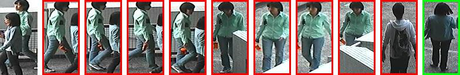  
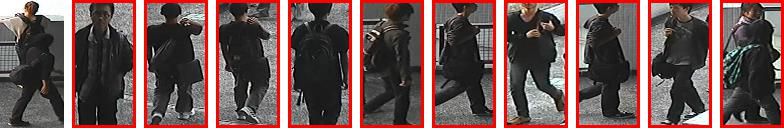  
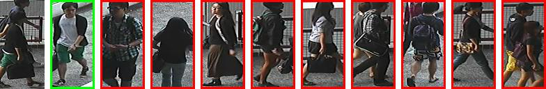  
  
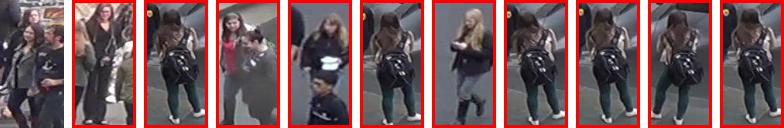

3. 低分辨率(有影响，但不是非常严重)：  
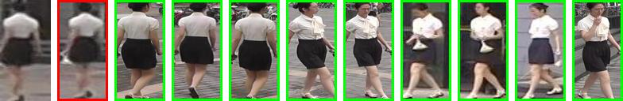  
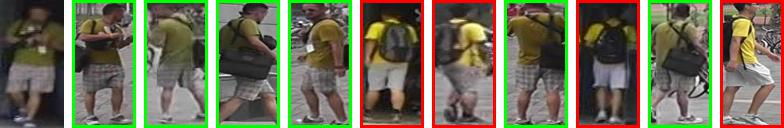  
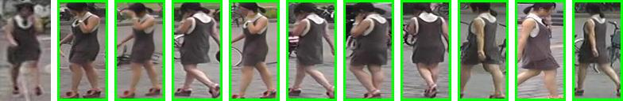  
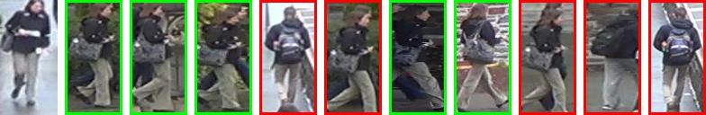  

4. 弱光线(黑衣服影响更大)：  
  
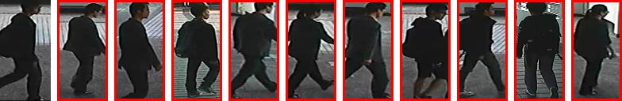  
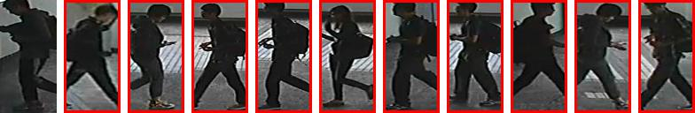  
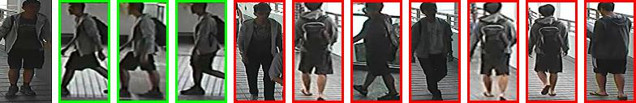

### 2. 看re-id跟mask, human parsing相结合的论文

- [CVPR2018: Human Semantic Parsing for Person Re-identification](https://github.com/wyg1997/PersonReID-paper/blob/master/documents/CVPR2018/Kalayeh_Human_Semantic_Parsing_CVPR_2018.pdf)   
>[解读](https://github.com/wyg1997/PersonReID-paper/blob/master/reading/CVPR2018/Kalayeh_Human_Semantic_Parsing_CVPR2018.md)

- [CVPR2018: MaskReID: A Mask Based Deep Ranking Neural Network for Person Re-identification](https://github.com/wyg1997/PersonReID-paper/blob/master/documents/CVPR2018/LiQi_MaskReID_A_Mask_Based_Deep_Ranking_Neural_Network_for_Reid_CVPR_2018.pdf)  
>[解读](https://github.com/wyg1997/PersonReID-paper/blob/master/reading/CVPR2018/Lei_MaskReID_CVPR2018.md)

- CVPR2018: Mask-guided Contrastive Attention Model for Person Re-Identification

### 3. 总结目前human parsing最好的模型

- CVPR2017: Look into Person: Self-supervised Structure-sensitive Learning and A New Benchmark for Human Parsing

- ICCV2015: Human Parsing with Contextualized Convolutional Neural Network

### 4. spatial attention的相关工作

- CVPR2018: Parameter-Free Spatial Attention Network for Person Re-Identification

### 5. human parsing模型训练

- 基于[CE2P](https://github.com/liutinglt/CE2P)  

- 参数设置：batch-size: 20, steps: 230000, input-size: (384, 128), random-scale: True, mirror: False  

- 分类信息重组织  

> 原分类：
>> 0.Background  
1.Hat  
2.Hair  
3.Glove  
4.Sunglasses  
5.UpperClothes  
6.Dress  
7.Coat  
8.Socks  
9.Pants  
10.Jumpsuits  
11.Scarf  
12.Skirt  
13.Face  
14.Left-arm  
15.Right-arm  
16.Left-leg  
17.Right-leg  
18.Left-shoe  
19.Right-shoe

> 新分类：
>> 0.Background  
1.[1, 2, 4, 13]  
2.[5, 6, 7, 9, 10, 11, 12]  
3.[14]  
4.[15]  
6.[16, 18]  
7.[17, 19]

- 资源占用统计  
Memory: 原项目中代码存在问题，程序开始占用10Gb，随后持续上升  
GPU Memory: 8.93Gb

- 训练结果数据  

> 384x128
>> Pixel Accuracy: 0.663313  
Mean accuracy: 0.314073  
Mean IU: 0.236828  
class_0: 0.7844  
class_1: 0.3227  
class_2: 0.3396  
class_3: 0.0990  
class_4: 0.1154  
class_5: 0.0567  
class_6: 0.0998

> 473x473
>> Pixel Accuracy: 0.834167  
Mean accuracy: 0.575554  
Mean IU: 0.475463  
class_0: 0.7844
class_1: 0.6652   
class_2: 0.6951  
class_3: 0.3543  
class_4: 0.4130  
class_5: 0.1832  
class_6: 0.2330

- 结果可视化

> LIP
>> 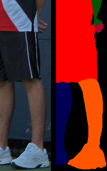左右手解析准确  
>> 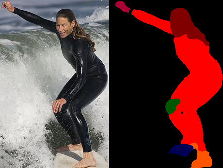整体解析比较准确  
>> 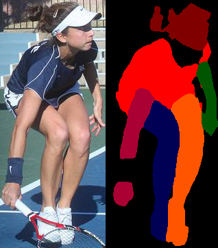  
>> 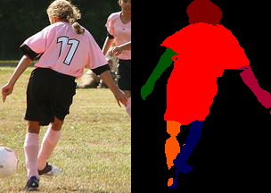

>> 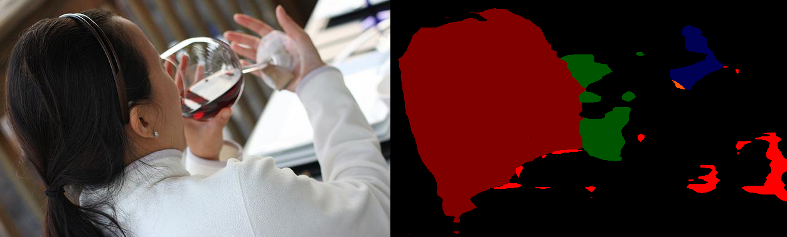  
>> 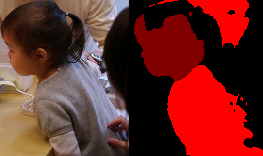多目标会解析到其它目标  
>> 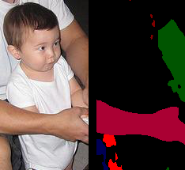多目标只解析到后面大人的信息  

> market1501(原数据集的原因，使饰品、背包等特征不能学习解析，但其它部件解析情况比较好)
>> 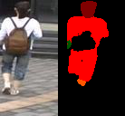  
>> 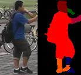一般目标解析效果不错  
>> 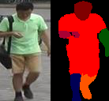  
>> 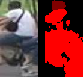低分辨率仍然有不小的影响  
>> 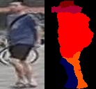低分辨率错误解析部件  
>> 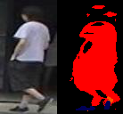目标与背景颜色接近，影响解析  
>> 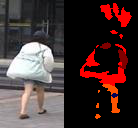未知原因不正常解析  

- CE2P训练总结

1. 训练可以达到一个不错的解析效果，少部分由于分辨率影响的图片可以考虑把解析后的特征和原图做一个加权，以减小影响。

2. 由于仅仅重组了原数据集的分类信息，导致像饰品、背包一类部件的信息丢失。

3. 仍然是由于分类信息不太好，导致胳膊、腿部只能解析裸露的皮肤，如果有衣服覆盖，则解析为衣服，所以这两部分的特征要小很多。
